# C++学习程序合集帮助文档
[toc]

## 项目源文件
[开头](#c学习程序合集帮助文档)
>`progam.h`

包含了学习程序的程序类声明
>`progam.cpp`

包含了学习程序的程序类定义
>`funs.h`

包含了学习程序的函数类声明
>`funs.cpp`

包含了学习程序的函数类定义
>`_main_.cpp`

包含了调用程序类的main函数和项目开发说明

## 文件关系图
[开头](#c学习程序合集帮助文档)

## 项目运行流程图
[开头](#c学习程序合集帮助文档)

## 项目函数
[开头](#c学习程序合集帮助文档)

类名：`uisefun`
注：此类函数参数类型通用，在项目里具有一定耦合性
|函数名称|函数原型|作用|
|:---:|:---:|:---:|
|uiseswap|`template<typename T> void uiseswap(T& a,T& b)`|交换a，b的值|
|arsize|`template<typename T> int arsize(const T & arry)`|返回静态arry数组的大小|
|armax|`template <typename T> double armax(const T &arry) `|返回静态arry数组中的最大值|
||`template <typename T> double armax(const T& arry, int size)`|返回动态arry数组中的最大值，size为数组大小|
|armin|`template <typename T> double armin(const T & arry)`|返回静态arry数组中的最小值|
||`template <typename T> double armin(const T & arry, int size)`|返回动态arry数组中的最小值，size为数组大小|
|arsum|`template <typename T> double arsum(const T & arry)`|返回静态arry数组中所有元素的和|
||`template <typename T> double arsum(const T & arry, int size)`|返回动态arry数组中所有元素的和，size为数组大小|
|ararea|`template <typename T> double ararea(const T & arry)`|返回静态arry数组的平均值|
||`template <typename T> double ararea(const T & arry, int size)`|返回动态arry数组的平均值，size为数组大小|
|arbs|`template <typename T> void arbs(T & arry,bool m)`|对静态数组arry进行冒泡排序，m为0升序，m为其他降序|
||`template <typename T> void arbs(T & arry,bool m, int size)`|对动态数组arry进行冒泡排序，m为0升序，m为其他降序，size为数组大小|
|arss|`	template <typename T> void arss(T& arry, bool m)`|对静态数组arry进行选择排序，m为0升序，m为其他降序|
||`	template <typename T> void arss(T& arry, bool m, int size)`|对动态数组arry进行选择排序，m为0升序，m为其他降序，size为数组大小|

类名：`exmath`
|函数名称|函数原型|作用|
|:---:|:---:|:---:|
|midcord|double midcord(double x, double y)|返x,y的中点，x,y必须同为横坐标或纵坐标|
|tpdi|double tpdi(double x, double y, double x2, double y2)|返回(x,y)与(x2,y2)的距离|
|slope|double slope(double A, double B)|返回A与B的斜率，其中A，B为直线方程Ax+By+C=0的A,B|
|Linpt|double Linpt(double C, double B)|返回C与B的纵截距，其中C，B为直线方程C的C,B|
|dofpn|double dofpn(double A, double B, double C1, double C2)|返回AX+BY+C1=0与AX+BY+C2=0的距离，其中两条直线的A,B必须相等，也就是平行|
|difpton|double difpton(double X, double Y, double A, double B, double C)|返回点(X,Y)与直线Ax+By+C=0的距离|
|chength|double chength(double r, double d)|返回圆心到相交直线距离d的直线在圆上的弦长，其中r为圆半径，r必须大于d|
|rearea|double rearea(double c, double k)|返回长c，宽k的长方形面积|
|regle|double regle(double c, double k)|返回长c，宽k的长方形周长|
|fac|long double fac(double N)|返回N的阶乘|
|hcf|int hcf(int m, int n)|返回m,n的最大公约数|
|lcd|int lcd(int m, int n)|返回m,n的最小公倍数|
|prnum|bool prnum(int k)|判断k是否为素数，是返回true,不是返回false|
|exrad|long long exrad(long long m, long long n)|返回范围[m,n]之内的随机数|
|dignum|int dignum(long long k)|返回k的数字位数|
|digsep|long long digsep(long long k, int m)|返回k从右向左数第m位的数字|
|probab|bool probab(int k)|k必须为整数且小于等于100，大于等于0，k%的概率返回true，100%-k%概率返回false|
|Decimal_Conversion|string Decimal_Conversion(long double number,long long Base)|返回十进制数number转换成Base进制后的字符串|

类名：`exdate`
|函数名称|函数原型|作用|
|:---:|:---:|:---:|
|epyear|bool epyear(int year)|判断year是否为闰年，是返回true，不是返回false|
|judate|bool judate(int year, int month, int day)|判断日期是否合理，合理返回true，不合理返回false|
|monday|int monday(int year, int month)|返回在year年中month月有多少天|

类名`exstr`
|函数名称|函数原型|作用|
|:---:|:---:|:---:|
|strfindchar|int strfindchar(string &t,char ch,int k);|返回字符串t中字符ch第k次出现的下标|

